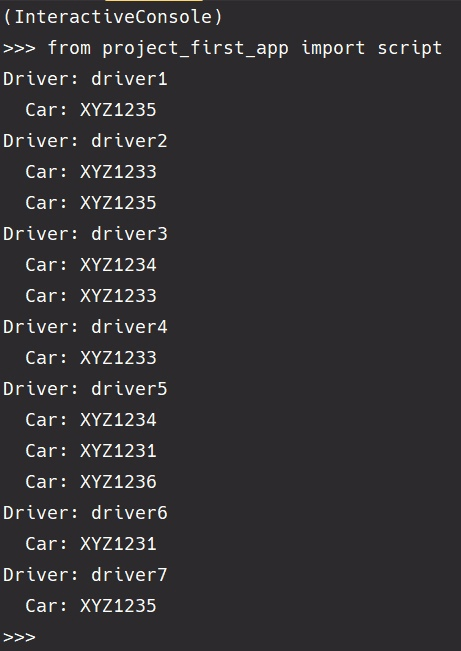

### Создания Автовладельцев и Автомобилей в Django

Скрипт генерирует автовладельцев, их автомобилей и водительских удостоверений, а также устанавливает связи между
владельцами и автомобилями.

#### Листинг Скрипта

```python
import random
from datetime import date, timedelta
from .models import Driver, Car, DriverLicense, Owning


def random_date(start, end):
    return start + timedelta(
        days=random.randint(0, int((end - start).days))
    )


for i in range(1, 8):
    driver = Driver.objects.create_user(
        username=f'driver{i}',
        email=f'driver{i}@example.com',
        password='password123',
        birth_date=random_date(date(1960, 1, 1), date(2000, 12, 31)),
        passport_number=f'AB12345{i}',
        home_address=f'123 Main St, City {i}',
        nationality='Country'
    )
    
    DriverLicense.objects.create(
        id_car_owner=driver,
        type='B',
        date_of_issue=random_date(date(2000, 1, 1), date.today())
    )

cars = []
for j in range(1, 7):
    car = Car.objects.create(
        state_number=f'XYZ123{j}',
        brand='BrandName',
        model=f'Model{j}',
        color='Blue'
    )
    cars.append(car)

for driver in Driver.objects.all():
    owned_cars = random.sample(cars, random.randint(1, 3))
    for car in owned_cars:
        Owning.objects.create(
            id_car_owner=driver,
            id_car=car,
            start_date=random_date(date(2010, 1, 1), date.today())
        )

for driver in Driver.objects.all():
    print(f'Driver: {driver.username}')
    for owning in Owning.objects.filter(id_car_owner=driver):
        print(f'  Car: {owning.id_car.state_number}')

```

#### Описание Скрипта

Создание объектов происходит через менеджер objects моделей

Скрипт выполняет следующие задачи:

1. **Создание Автовладельцев:**
   <br>Генерирует 7 автовладельцев с уникальными данными.

2. **Выдача Водительских Удостоверений:**
   <br>Для каждого владельца создаётся водительское удостоверение с указанием типа и даты выдачи.

3. **Создание Автомобилей:**
   <br>Генерирует 6 автомобилей с уникальными данными.

4. **Связь Автовладельцев с Автомобилями:**
   <br>Каждому владельцу случайным образом назначается от 1 до 3 автомобилей через модель `Owning`.

#### Результаты выполнения скрипта

