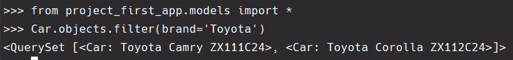
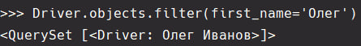
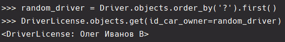
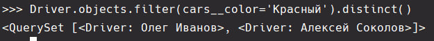
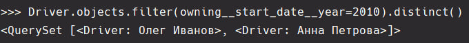

### Создание простых запросов

#### 1. **Машины Определённой Марки:**

<br>Получаем все машины марки “Toyota”.
<br>**Листинг кода**

```python
Car.objects.filter(brand='Toyota')
```

**Результат**
<br>


#### 2. **Водители с Конкретным Именем:**

<br>Извлекаем данные всех водителей с именем “Олег”.
<br>**Листинг кода**

```python
Driver.objects.filter(first_name='Олег')
```

**Результат**
<br>


#### 3. **Удостоверение По ID Владельца:**

<br>Сначала выбираем случайного владельца, затем находим его удостоверение по ID.
<br>**Листинг кода**

```python
random_driver = Driver.objects.order_by('?').first()
DriverLicense.objects.get(id_car_owner=random_driver)
```

**Результат**
<br>


#### 4. **Владельцы Автомобилей Определённого Цвета:**

<br>Выводим информацию о всех владельцах красных машин.
<br>**Листинг кода**

```python
Driver.objects.filter(cars__color='Красный').distinct()
```

**Результат**
<br>


#### 5. **Владельцы с Годом Начала Владения:**

<br>Ищем владельцев, начавших владеть автомобилем с 2010 года.
<br>**Листинг кода**

```python
Driver.objects.filter(owning__start_date__year=2010).distinct()
```

**Результат**
<br>
