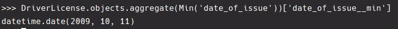
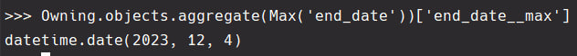
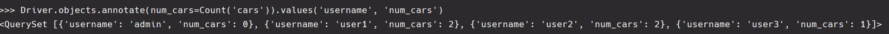
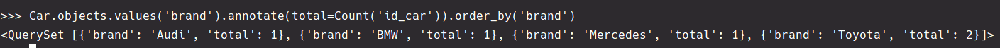
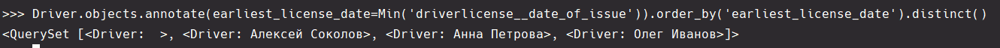

### Агрегация и Аннотация Запросов в Django

#### 1. **Дата Выдачи Самого Старшего Водительского Удостоверения:**

<br>Находим дату выдачи самого старого водительского удостоверения в базе.
<br>**Листинг кода**

```python
from django.db.models import Min

DriverLicense.objects.aggregate(Min('date_of_issue'))
```

**Результат**
<br>


#### 2. **Самая Поздняя Дата Владения Машиной:**

<br>Определяем самую позднюю дату владения машиной среди всех записей.
<br>**Листинг кода**

```python
from django.db.models import Max

Owning.objects.aggregate(Max('end_date'))
```

**Результат**
<br>


#### 3. **Количество Машин для Каждого Водителя:**

<br>Подсчитываем количество машин, принадлежащих каждому водителю.
<br>**Листинг кода**

```python
from django.db.models import Count

Driver.objects.annotate(num_cars=Count('cars')).values('username', 'num_cars')
```

**Результат**
<br>


#### 4. **Количество Машин Каждой Марки:**

<br>Вычисляем количество машин для каждой марки автомобиля.
<br>**Листинг кода**

```python
Car.objects.values('brand').annotate(total=Count('id_car')).order_by('brand')
```

**Результат**
<br>


#### 5. **Сортировка Автовладельцев По Дате Выдачи Удостоверения:**

<br>Сортируем автовладельцев по дате выдачи их первого водительского удостоверения.
<br>**Листинг кода**

```python
Driver.objects.annotate(earliest_license_date=Min('driverlicense__date_of_issue')).order_by(
    'earliest_license_date'
).distinct()
```

**Результат**
<br>
